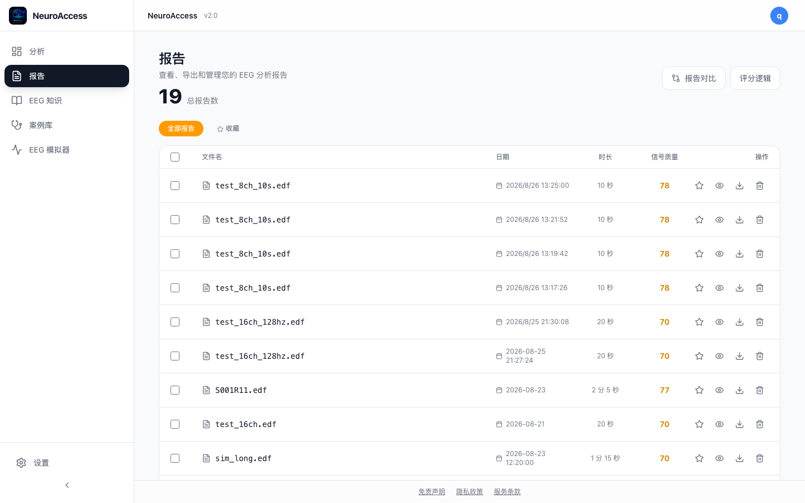
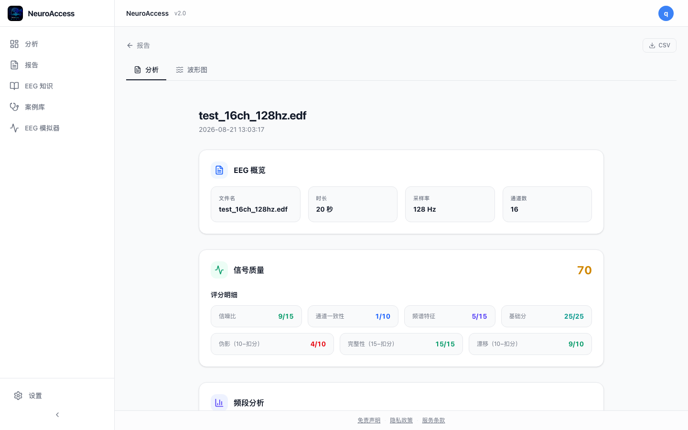
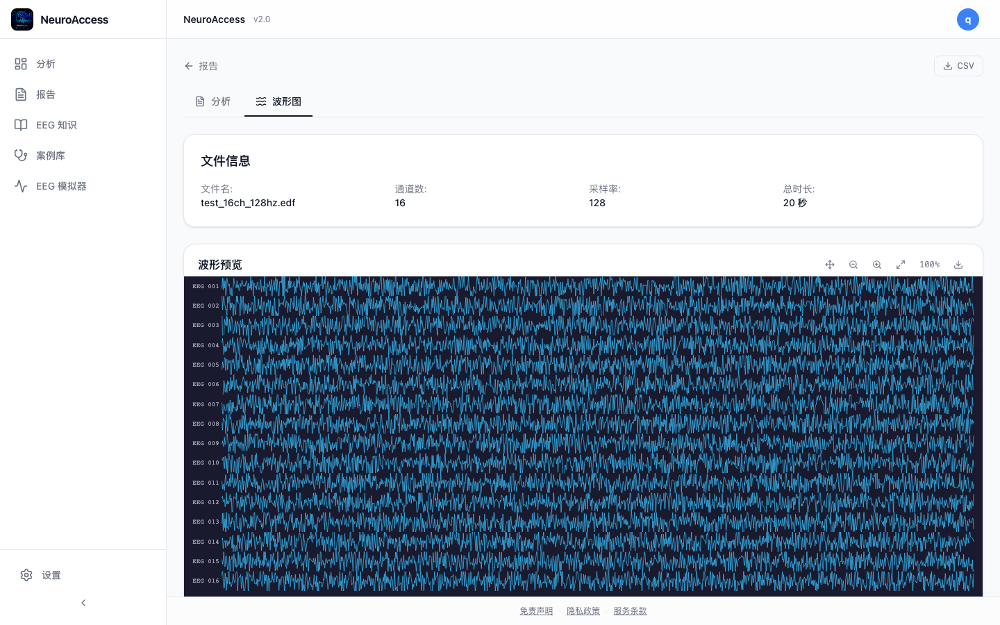
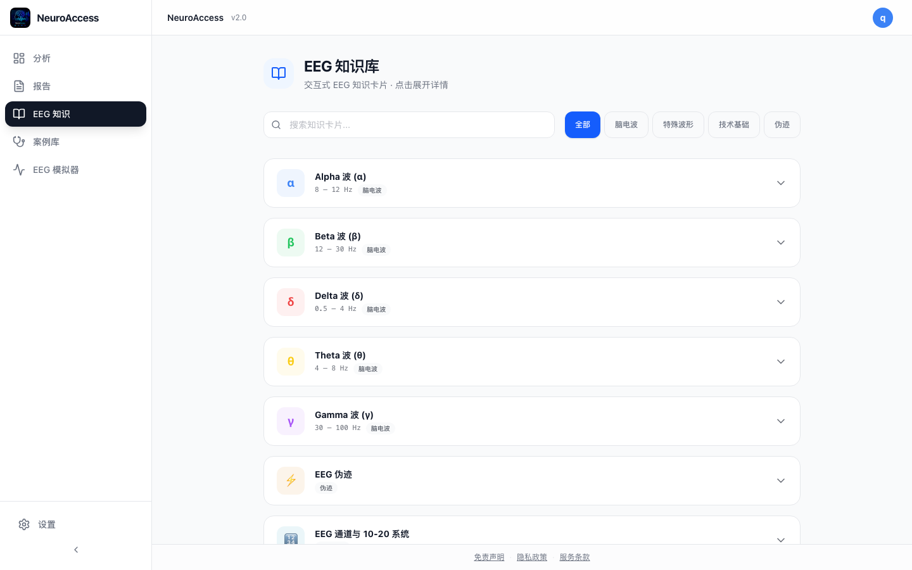
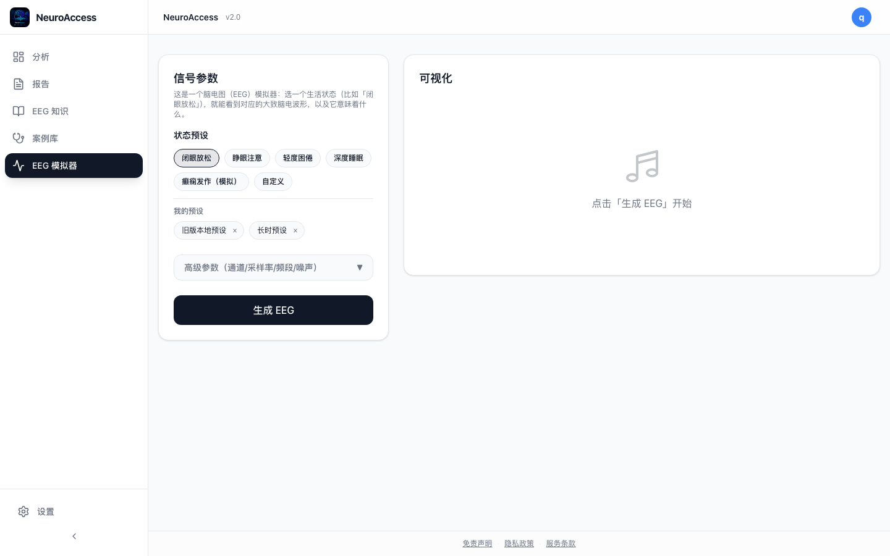
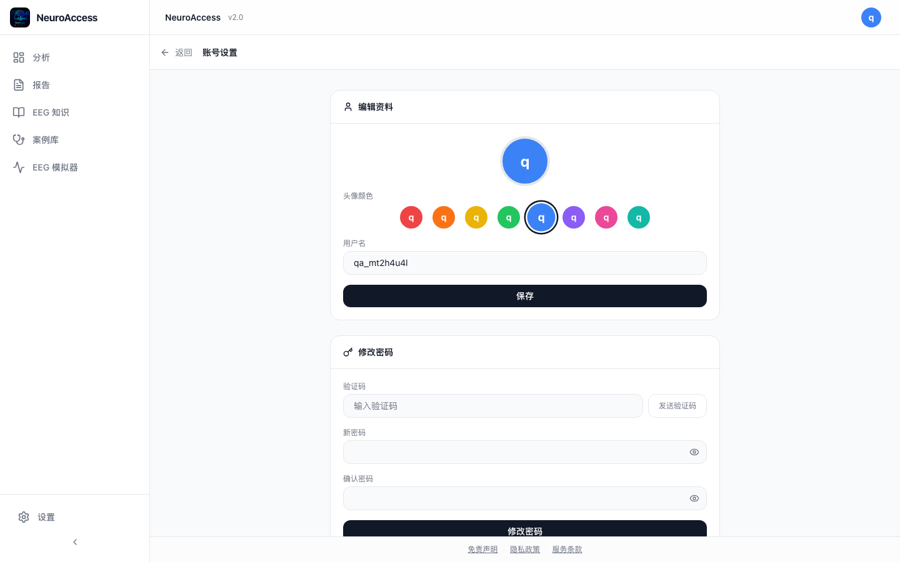

# NeuroAccess

**Open-source AI for Brain Science & EEG Education**

NeuroAccess is a free and open-source educational project that uses AI and interactive visualization to make EEG and neuroscience easier to understand.

## Why NeuroAccess?

EEG and neuroscience can be difficult for students and beginners to approach. Existing EEG tools are often designed for researchers and require specialized knowledge.

NeuroAccess aims to lower this barrier by combining AI-assisted explanations with interactive EEG visualization and educational resources.

## What NeuroAccess Does

- AI-assisted EEG analysis and explanation
- Interactive EEG visualization
- Educational exploration of brain signals
- Beginner-friendly learning experience
- Support for neuroscience and EEG education
- Open-source tools and resources for developers and educators

## Screenshots

| | |
|---|---|
|  |  |
|  |  |
|  |  |
|  |  |

## Our Approach

NeuroAccess is designed as an educational resource rather than a medical or clinical system.

It does not provide medical diagnosis or clinical decisions.

The project can be explored with sample EEG datasets, making it possible to learn and experiment without requiring personal EEG data.

## Open Source

NeuroAccess is developed openly on GitHub ([MossDominicus/NeuroAccess](https://github.com/MossDominicus/NeuroAccess)).

The goal is not only to build a website, but to create an accessible open-source project that students, educators, researchers, and developers can explore, improve, and build upon.

Contributions, suggestions, issue reports, and educational use cases are welcome.

## Vision

We believe that advanced neuroscience education should not be limited to laboratories or specialists.

NeuroAccess aims to make brain science more accessible through AI and open technology.

## Website

https://neuroaccess.cloud

## Project Status

NeuroAccess is an actively developing open-source project.

New features, educational resources, and improvements will be added over time.

## Contributing

Interested in contributing?

You can:

- Explore the code
- Report issues
- Suggest improvements
- Improve documentation
- Create educational resources
- Submit pull requests

Every contribution can help make neuroscience education more accessible.

## License

This project is licensed under the [MIT License](LICENSE).
